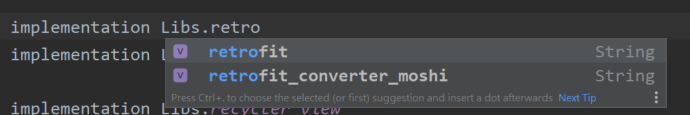
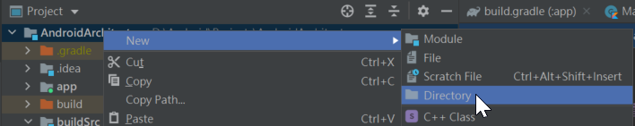
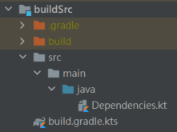

用 buildSrc管理 gradle
===

優點
---
* 可以透過buildSrc統一管理第三方程式碼  
* 支援自動補全程式碼  

缺點
---
* 每次變動都會讓整個gradle重新建構一次   
  所以目前已經有人開始提倡用Composing builds取代buildSrc  
  使用優點相同 不過每次改動不會都需要重跑一次
  
使用方法

在project目錄下 建立一個_buildSrc_ 資料夾 名稱一定要是buildSrc

在buildSrc下 建立[build.gradle.kts](buildSrc/build.gradle.kts) 檔案 內容一樣

這邊可以先跑一下 gradle sync

在buildSrc/src/main/java 下建立[Dependencies.kt](buildSrc/src/main/java/Dependencies.kt) 或是其他自訂的名稱

最後的檔案結構會如下

之後就可以在gradle上 直接使用該目錄檔案下的數值或方法

參考 
https://proandroiddev.com/better-dependencies-management-using-buildsrc-kotlin-dsl-eda31cdb81bf 
https://handstandsam.com/2018/02/11/kotlin-buildsrc-for-better-gradle-dependency-management/ 
https://juejin.cn/post/6844904176250519565