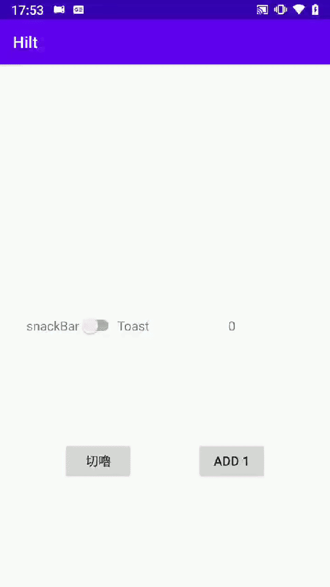

Hilt

Hilt 是個基於dagger架構上開發的DI(dependency injection)套件，
透過annotation的方式，讓編譯器在compile的時候幫你把值賦予(@Provide)到你想要的地方(@Inject)
減少在code上把資料手動傳來傳去的行為
隨著Hilt的發展，還可以搭配MVVM或其他Android的架構使用。

本篇主要是理解Hilt的基本用法 包括在Application的初始
以及inject,provide 和 同類型的物件該如何利用Qualifier正確的給值
會將自己的解釋 寫在code旁邊當註解

功能非常簡單
點了按鈕會有兩種顯示方式 Toast,snackBar
透過switch 去切換顯示方式

